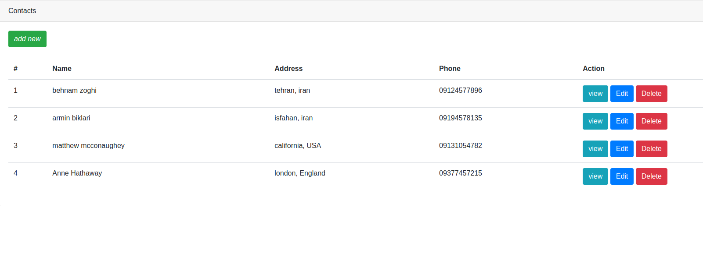

# laravel 8 crud application
### Installation
1. Clone repo
2. Change directory
````
cd laravel-crud
````
3. Install dependencies
````
composer install
````
4. copy .env file
````
cp .env.example .env
````
5. Modify `DB_*` value in `.env` with your database config.
6. Generate application key:
````
php artisan key:generate
````
7. Migrate
````
php artisan migrate
````

## screenshot
